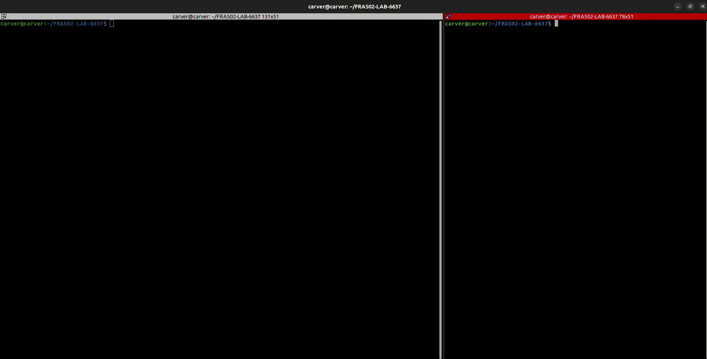
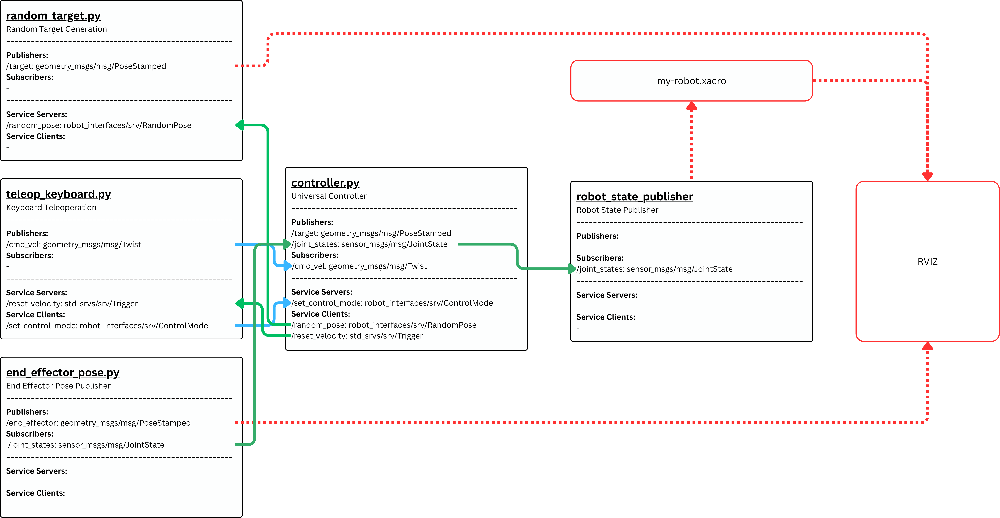

# LAB4: 3R Kinematics

## Table of Contents
- [LAB4: 3R Kinematics](#lab4-3r-kinematics)
  - [Table of Contents](#table-of-contents)
  - [Demo Video](#demo-video)
  - [Project Overview](#project-overview)
  - [System Architecture](#system-architecture)
    - [Core Components](#core-components)
  - [Setup Instructions](#setup-instructions)
    - [1. Clone Repository](#1-clone-repository)
    - [2. Build Workspace](#2-build-workspace)
    - [3. Environment Setup](#3-environment-setup)
  - [Custom Service Interfaces](#custom-service-interfaces)
  - [How to Run](#how-to-run)
    - [1. Launch Main System](#1-launch-main-system)
    - [2. Start Keyboard Controller (Separate Terminal)](#2-start-keyboard-controller-separate-terminal)
    - [3. Control Operations](#3-control-operations)
  - [Launch file Configuration](#launch-file-configuration)
  - [Acknowledgments](#acknowledgments)

## Demo Video
[](./media/demo.mp4)

## Project Overview

This ROS2 project is designed to control a 3-DOF robotic arm using inverse kinematics, teleoperation, and an auto mode. The system allows users to control the arm in different modes, compute inverse kinematics solutions, and request random poses for the robot to move to, all while adhering to the constraints of the robot's workspace.


## System Architecture
[](./media/SA.pdf)
### Core Components

**1. Universal Controller** (`controller.py`)
A sophisticated node that adapts its behavior based on the robot's control mode:
  - Inverse Kinematics Mode (IPK): Computes joint configurations to reach a target position in task space.
  
  - Teleoperation Mode (TO): Moves the robot in response to velocity commands, either in the world frame or end effector frame.

  - Auto Mode (AM): Requests a random pose and moves the robot to it.

**2. Random Target Generation** (`random_target.py`)
This node generates random target poses within the defined workspace, ensuring that the generated poses are within the robot's operating limits. These poses are served via a ROS2 service (`/random_pose`).

**3. End Effector Pose Publisher** (`end_effector_pose.py`)
This node listens to joint state updates and publishes the current pose of the end effector at regular intervals. The pose is published on the `/end_effector` topic, allowing visualization in RViz2.

**4. Keyboard Teleoperation** (`teleop_keyboard.py`)
A user-friendly command-line interface that allows for real-time control of the robot using the keyboard. It supports all three modes:
   - **IPK Mode**: The user can specify a target position for the robot.

   - **TO Mode**: The user can control the velocity of the end effector.

   - **AM Mode**: The user can initiate the automatic random pose sequence

## Setup Instructions
### 1. Clone Repository
```bash
cd ~/
git clone https://github.com/pboon09/FRA502-LAB-6637.git -b LAB4
cd FRA502-LAB-6637
```

### 2. Build Workspace
```bash
# Install dependencies
rosdep install --from-paths src --ignore-src -r -y

# Build
colcon build

# Source workspace
source install/setup.bash
```

### 3. Environment Setup
Add to your `~/.bashrc`:
```bash
echo "source ~/FRA502-LAB-6637/install/setup.bash" >> ~/.bashrc  
```

Then source:
```bash
source ~/.bashrc
```

## Custom Service Interfaces

The project defines several custom service interfaces:

**ControlMode.srv**:
```
uint8 mode
float64 x
float64 y
float64 z
---
uint8 current_mode
bool success
string message
float64[] q_solution 
```

**RandomPose.srv**:
```
---
geometry_msgs/PoseStamped pose
```

## How to Run
### 1. Launch Main System
```bash
ros2 launch robot_controller bringup.launch.py
```

### 2. Start Keyboard Controller (Separate Terminal)
```bash
ros2 run robot_controller teleop_keyboard.py 
```

### 3. Control Operations
Please refer to the on-screen interface to control the robot. Use the following keys to interact:
**Keyboard Controls**:
- **Movement (World Frame / Effector Frame):**
  - i: Move +x direction (forward)
  - k: Move -x direction (backward)
  - j: Move +y direction (left)
  - l: Move -y direction (right)
  - u: Move +z direction (up)
  - o: Move -z direction (down)
  - space: Stop movement (reset to zero velocities)

- **Frame Mode Switching:**
  - w: Switch to World Frame
  - e: Switch to Effector Frame

- **Panel Switching:**
  - 1: Switch to IPK panel
  - 2: Switch to Teleop (TO) panel
  - 3: Switch to Auto Mode (AM) panel

Control/Mode:
  - r: Enter target coordinates for IPK (x, y, z)
  - a: Start/step Auto Mode (AM)
  - q: Quit the teleoperation interface

## Launch file Configuration
You can modify the workspace size by changing the following parameters in the launch file:
```python
'parameters': [{
    'r_min': 0.020,
    'r_max': 0.530,
    'z_min': -0.330,
    'z_max': 0.730
}]
```

If you want to print the comparison between forward kinematics (FK) and transform (TF), you can enable the `debug` parameter in the launch file:
```python
end_effector_pub = Node(
    package='robot_controller',
    executable='end_effector_pose.py',
    name='end_effector_publisher',
    output='screen',
    parameters=[{
        'debug': True  # Set to True to print FK and TF comparison output
    }]
)
```

## Acknowledgments

**ROS2 Community**: For the comprehensive robotics framework

**[ROS2_pkg_cpp_py](https://github.com/tchoopojcharoen/ROS2_pkg_cpp_py)**: ROS2 package template supporting both C++ and Python development, used as the foundation for this mixed-language project.

**Project Status**: Complete  
**Last Updated**: November 2025  
**Maintainer**: Phakin Boonchanachai / FIBO FRAB10
